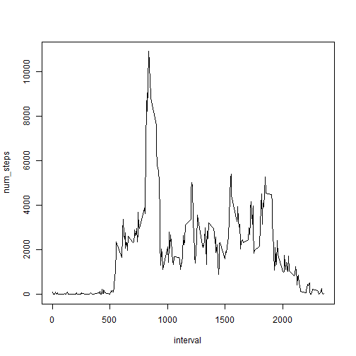

```r
# Setting the Working Dir
setwd("C:/Users/arijitkumar/Desktop/Coursera/Reproducible_Research/Week_2")

# Importing the fie
activity <-read.csv("./activity.csv")

# Setting the packages
library(knitr)
library(dplyr)
```

```
## 
## Attaching package: 'dplyr'
## 
## The following objects are masked from 'package:stats':
## 
##     filter, lag
## 
## The following objects are masked from 'package:base':
## 
##     intersect, setdiff, setequal, union
```

```r
library(xtable)
library(ggplot2)

# Converting the data frame using dplr
activity2 <- tbl_df(activity)

# Creating histogram
num_steps_daywise <- filter(activity2,!(is.na(steps))) %>% group_by(date) %>% summarise(num_steps=sum(steps))
hist(num_steps_daywise$num_steps)
```

 

```r
# Getting Mean n median
summary(num_steps_daywise)
```

```
##          date      num_steps    
##  2012-10-02: 1   Min.   :   41  
##  2012-10-03: 1   1st Qu.: 8841  
##  2012-10-04: 1   Median :10765  
##  2012-10-05: 1   Mean   :10766  
##  2012-10-06: 1   3rd Qu.:13294  
##  2012-10-07: 1   Max.   :21194  
##  (Other)   :47
```

```r
# Mean is 10766, Median is 10765

# Time Series plot
num_steps_intwise <- filter(activity2,!(is.na(steps))) %>% group_by(interval) %>% summarise(num_steps=sum(steps))
with(num_steps_intwise,plot(interval,num_steps,type="l"))
```

 

```r
# Getting max number of steps interval
max_5_int <- head(arrange(num_steps_intwise,desc(num_steps)),1)
max_5_int
```

```
## Source: local data frame [1 x 2]
## 
##   interval num_steps
##      (int)     (int)
## 1      835     10927
```

```r
# Interval 835 has the max number of steps

# Missing vales
count_NA <- nrow(filter(activity2,(is.na(steps))))
# Total number of missing vales = 2304

#Strategy for impting the missing values
NA_Val <-filter(activity2,(is.na(steps)))
mean_steps_intwise <- filter(activity2,!(is.na(steps))) %>% group_by(interval) %>% 
      summarise(mean_steps=(round(mean(steps),0)))

NA_Val_Mean <- merge(NA_Val,mean_steps_intwise,by.x="interval",by.y="interval",all=TRUE)
NA_Val_Mean <- tbl_df(NA_Val_Mean)

NA_Val_Mean2 <- select(NA_Val_Mean,interval,date,mean_steps) %>% rename(steps=mean_steps)
no_miss_val <- filter(activity2,!(is.na(steps)))

# Getting the clean data
clean_data <- rbind(no_miss_val,NA_Val_Mean2)

# Histogram for clean data
num_steps_daywise_clean <- group_by(clean_data,date) %>% summarise(num_steps=sum(steps))
hist(num_steps_daywise_clean$num_steps)
```

 

```r
# Getting Mean n median of clean data
summary(num_steps_daywise_clean)
```

```
##          date      num_steps    
##  2012-10-01: 1   Min.   :   41  
##  2012-10-02: 1   1st Qu.: 9819  
##  2012-10-03: 1   Median :10762  
##  2012-10-04: 1   Mean   :10766  
##  2012-10-05: 1   3rd Qu.:12811  
##  2012-10-06: 1   Max.   :21194  
##  (Other)   :55
```

```r
# Mean is 10766, Median is 10762
```


